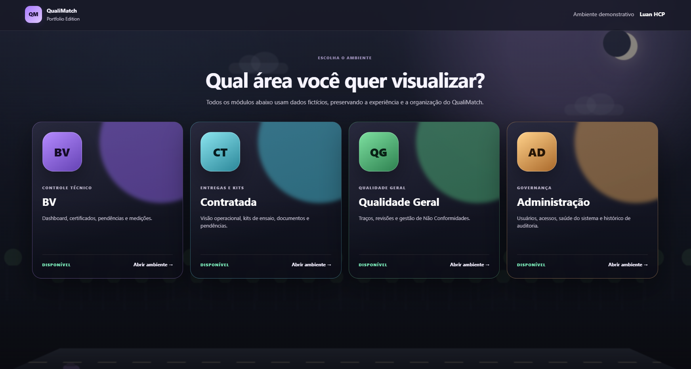
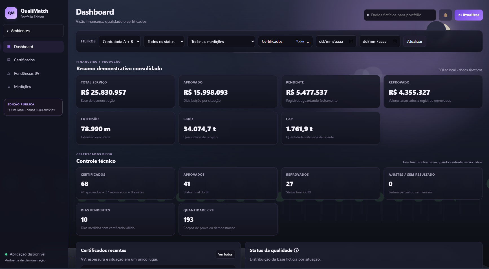
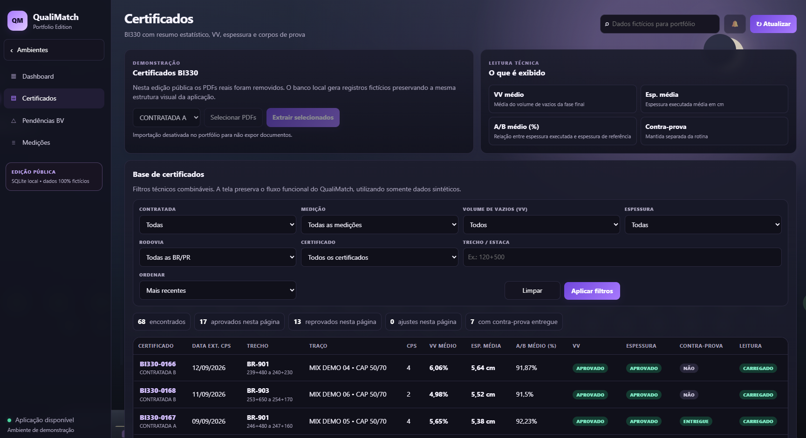
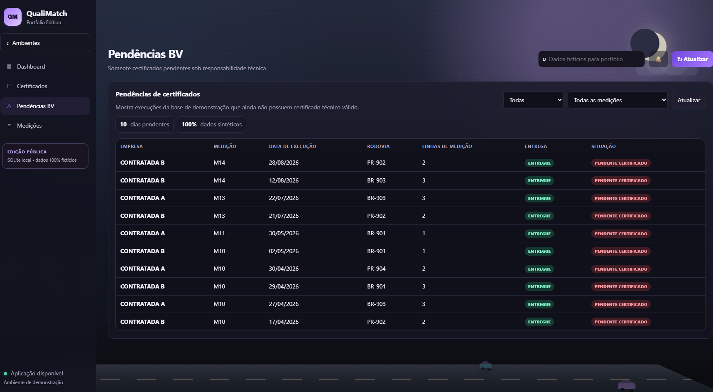
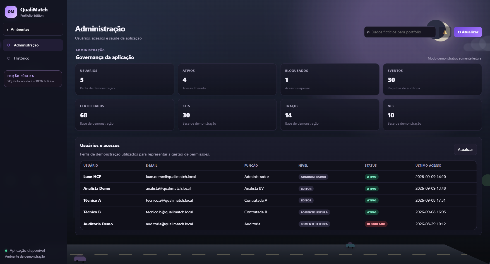
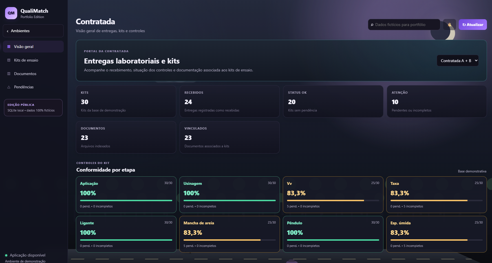
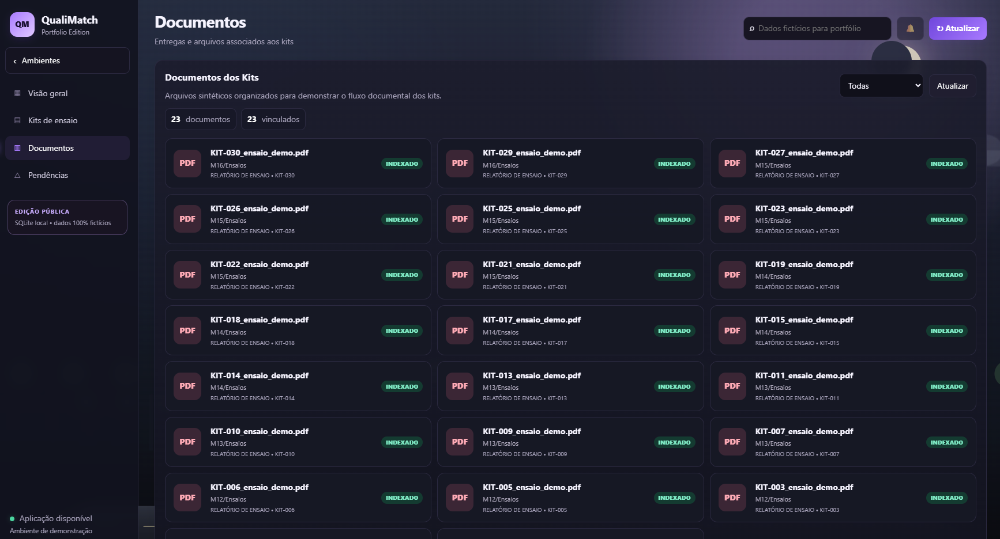

# QualiMatch — Portfolio Edition

    

O QualiMatch é uma aplicação web voltada à organização e análise de informações de qualidade em obras de infraestrutura. Esta **Portfolio Edition** preserva os principais fluxos, regras de negócio e identidade visual do projeto, substituindo integralmente dados e integrações operacionais por uma base local de demonstração.

> **Importante:** todos os nomes de empresas, rodovias, certificados, traços, documentos, valores, usuários e registros desta edição são fictícios. Nenhum dado operacional real é distribuído neste repositório.

## Contexto

Obras de infraestrutura rodoviária (pavimentação, CBUQ) exigem controle técnico contínuo — certificados de ensaio, medições por ciclo, rastreio de não conformidades e auditoria de acessos. Historicamente esse controle é feito de forma fragmentada, em planilhas isoladas por contratada, o que gera atraso na identificação de pendências e retrabalho na consolidação de indicadores. O QualiMatch centraliza esses fluxos em um único sistema multiportal, com regras técnicas automatizadas para classificar resultados (aprovado, reprovado, pendente) assim que os dados entram na base.

## Capturas de tela

### Seleção de ambientes
O sistema é organizado em quatro portais, cada um com menus e permissões próprias.



### Dashboard (BV)
Visão financeira e técnica consolidada, com filtros por contratada, status e ciclo de medição.



### Certificados BI330
Base filtrável de certificados com VV médio, espessura, relação A/B e status de leitura.



### Pendências BV
Cruzamento entre execuções e certificados para identificar dias sem certificado técnico válido.



### Administração
Governança da aplicação: usuários, níveis de acesso e indicadores da base de demonstração.



### Portal da Contratada
Conformidade por etapa (aplicação, usinagem, ligante, Vv, taxa, mancha de areia, pêndulo, espessura úmida) e status de entrega dos kits.



### Documentos
Arquivos indexados e vinculados a cada kit de ensaio.



<!--
Ambiente Qualidade Geral (Traços e Não Conformidades) ainda sem captura —
a base de demonstração para esse módulo não foi gerada nesta edição.
-->

## Visão geral

A aplicação foi organizada em quatro ambientes:

| Ambiente | Recursos demonstrados |
|---|---|
| BV | Dashboard, certificados BI330, pendências e medições |
| Contratada | Visão geral, kits de ensaio, documentos e pendências |
| Qualidade Geral | Traços e gestão de Não Conformidades |
| Administração | Usuários, indicadores da aplicação e histórico de auditoria |

A navegação entre os ambientes reproduz a experiência de um sistema corporativo multiportal, mantendo cada área com menus e informações próprias.

## Principais recursos

### Dashboard e certificados
- indicadores financeiros e técnicos
- filtros por contratada, status e ciclo de medição M**xx** (ciclo de medição mensal, ex.: M01, M02...)
- seleção múltipla de certificados
- consulta de resultados de Vv (volume de vazios), espessura e relação A/B
- contra-prova e estado de leitura
- detalhes de corpos de prova
- paginação de 30 certificados por página

### Medições e pendências
- base operacional sintética
- cruzamento entre datas de execução e certificados
- identificação de dias pendentes
- pesquisa e paginação de 40 linhas por página

### Portal da Contratada
- visão consolidada dos kits
- controles por etapa
- documentos associados
- status de entrega
- identificação de kits pendentes ou incompletos

### Qualidade Geral
- cadastro demonstrativo de traços
- usina, fornecedor, ligante, revisão e vigência
- Não Conformidades com categoria, severidade, prazo, ação e status

### Administração
- usuários e níveis de acesso
- status de conta
- indicadores da base de demonstração
- histórico de auditoria com eventos simulados

## Banco de demonstração

Na primeira execução, a aplicação cria automaticamente um banco SQLite local:

```
data/qualimatch_demo.db
```

A geração é determinística, permitindo recriar sempre o mesmo cenário de demonstração com:

- dezenas de certificados BI330
- mais de uma centena de linhas de medição
- kits e documentos
- traços
- Não Conformidades
- usuários e eventos de auditoria
- aprovações, reprovações, resultados parciais e pendências
- valores financeiros, extensão, CBUQ e CAP sintéticos

O banco gerado fica fora do versionamento por meio do `.gitignore`.

### Recriar a base

```bash
python reset_demo.py
```

## Regras técnicas demonstradas

A edição pública utiliza regras de demonstração para exercitar os estados da interface:

- **Vv** (volume de vazios): aprovado entre 3,5% e 7,5%
- **A/B**: aprovado a partir de 90%
- **espessura**: aprovada a partir de 4,5 cm
- ausência de resultado é apresentada como `SEM RESULTADO`

Esses limites existem apenas para a demonstração pública e não devem ser interpretados como especificação contratual ou critério de uma operação real.

## Tecnologias

**Backend**
- Python 3.12+
- FastAPI
- SQLite
- API REST em JSON

**Frontend**
- HTML5
- CSS3
- JavaScript sem framework
- interface responsiva
- animações CSS e cenário de rodovia

**Qualidade de código**
- Pytest
- GitHub Actions
- validação de sintaxe JavaScript
- compilação dos módulos Python no CI

## Arquitetura

```
┌──────────────────────────┐
│        Frontend          │
│ HTML • CSS • JavaScript  │
└────────────┬─────────────┘
             │ HTTP / JSON
             ▼
┌──────────────────────────┐
│         FastAPI          │
│ Rotas • filtros • regras │
└────────────┬─────────────┘
             │
             ▼
┌──────────────────────────┐
│     Camada de domínio    │
│ Vv • A/B • ciclos Mxx    │
└────────────┬─────────────┘
             │
             ▼
┌──────────────────────────┐
│      SQLite local        │
│ Dados 100% sintéticos    │
└──────────────────────────┘
```

Mais detalhes estão em `docs/ARCHITECTURE.md`.

## Executar localmente

**Windows**

```bash
git clone https://github.com/LuanHCP/Qualimatch_portfolio.git
cd Qualimatch_portfolio

python -m venv .venv
.venv\Scripts\activate
pip install -r requirements.txt
python run.py
```

Acesse:

```
http://127.0.0.1:8000
```

A documentação interativa da API fica disponível em:

```
http://127.0.0.1:8000/docs
```

## Estrutura do projeto

```
Qualimatch_portfolio/
├── app.py
├── database.py
├── domain.py
├── reset_demo.py
├── run.py
├── requirements.txt
├── data/
│   └── qualimatch_demo.db    # gerado localmente
├── docs/
│   ├── ARCHITECTURE.md
│   └── images/                # screenshots usadas neste README
└── frontend/
    ├── index.html
    ├── styles.css
    └── app.js
```

## Privacidade e sanitização

A Portfolio Edition foi criada especificamente para apresentação pública. Ela não contém credenciais, documentos internos, caminhos corporativos, planilhas de produção ou bancos de dados operacionais.

Integrações existentes no projeto original, como autenticação, banco corporativo, processamento de documentos e sincronização de arquivos, são representadas nesta edição apenas quando podem ser demonstradas de forma segura e independente.

---

Desenvolvido por **Luan HCP** como projeto de software, automação e análise aplicada à gestão da qualidade.
